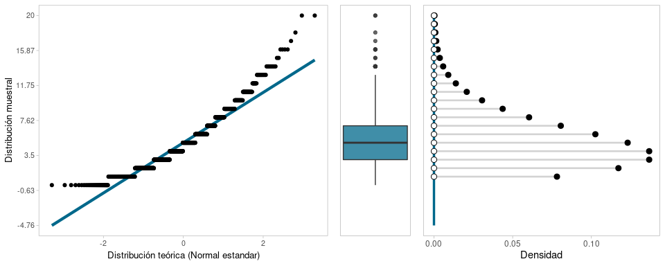
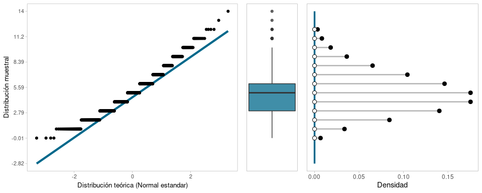

# Problemas y Simulaciones.

1. _(Problema 273)_ Sea $X$ una variable aleatoria con distribución uniforme en el conjunto ${1, \ldots , n}$ y sean $x$, $x_1$, y $x_2$ números dentro de este conjunto en donde $x_1 < x_2$. Encuentre las siguientes probabilidades:

* $P(X \le x)$
* $P(X \ge x)$
* $P(x_1 \le X \le x_2)$
* $P(x_1 < X \le x_2)$
* $P(x_1 \le X < x_2)$
* $P(x_1 < X < x_2)$

Se tiene que la función de probabilidad es $f(x) = 1/n$ por ser una distibución uniforme. Para la primera probabilidad solo se calcula la funcion de distribucion acumulada para valores menores que $x$:

$$P(X \le x) = \sum_{i=1}^x f(x) = \sum_{i=1}^x \frac{1}{n} = \frac{1}{n}\sum_{i=1}^x1 = \frac{x}{n}$$

Para la siguiente probabilidad:

$$P(X\ge x) = 1-P(X < x) = 1-\sum_{i=1}^{x - 1}f(x) = 1-\frac{1}{n}\sum_{i=1}^{x-1}1 = 1-\frac{x-1}{n}$$

Para las siguientes probabilidades:

$$P(x_1 \le X \le x_2) = P(X \le x_2) - P(X \le x_1) = \frac{x_2}{n} - \frac{x_1}{n} = \frac{x_2 - x_1}{n}$$

$$P(x_1 < X \le x_2) = P(X \le x_2) - P(X < x_1) = \frac{x_2}{n} - \frac{x_1 - 1}{n} = \frac{x_2 - x_1 + 1}{n}$$

$$P(x_1 \le X < x_2) = P(X < x_2) - P(X \le x_1) = \frac{x_2 - 1}{n} - \frac{x_1}{n} = \frac{x_2 - x_1 - 1}{n}$$

$$P(x_1 < X < x_2) = P(X < x_2) - P(X < x_1) = \frac{x_2 - 1}{n} - \frac{x_1 - 1}{n} = \frac{x_2 - x_1}{n}$$

2. _(Problema 274)_ Sea $X$ una variable aleatoria con distribución uniforme en el conjunto $\{-1, 0, 1\}$. Demuestre que las variables aleatorias $X^3$ y $-X$ tienen la misma distribución que $X$.

Las variables aleatorias $X^3$ y $-X$ toman los mismos valores que $X$, es decir, su valores estan contenidos en el conjunto  $\{-1, 0, 1\}$ de forma que, para $X^3$:

$$
\begin{aligned} 
	P(Y = 0) &= P(X^3 = 0) = P(X = 0) = 1/3 \\ 
	P(Y = 1) &= P(X^3 = 1) = P(X = \sqrt[3]{1}) = P(X = 1) = 1/3 \\
	P(Y = -1) &= P(X^3 = -1) = P(X = \sqrt[3]{-1}) = P(X = -1) = 1/3 
\end{aligned}
$$

y para $-X$:

$$
\begin{align*} 
	P(Y = 0) &= P(-X = 0) = P(X = 0) = 1/3 \\ 
	P(Y = 1) &= P(-X = 1) = P(X = -1) = 1/3 \\
	P(Y = -1) &= P(-X = -1) = P(X = 1) = 1/3 
\end{align*}
$$

y se demuestra que las distribuciones son las mismas. 

3. _(Problema 275)_ Sea $X$ una variable aleatoria con distribución uniforme en el conjunto $\{1, \ldots , n\}$. Demuestre que:

* $E(X) = (n + 1) / 2$
* $E(X^2) = (n + 1)(2n + 1) / 6$
* $Var(X) = (n^2 - 1) / 12$

Para la esperanza de $X$ se tiene:

$$E(X) = \sum_{x=1}^n xf(x) = \sum_{x=1}^n x\frac{1}{n} = \frac{1}{n}\times(1 + 2 + 3 + \ldots + n) = \frac{1}{n}\frac{n(n+1)}{2} = \frac{n + 1}{2}$$

Para la esperanza de $X^2$ se tiene:

$$E(X^2) = \sum_{x=1}^n x^2\frac{1}{n} = \frac{1}{n}\times(1 + 4 + 9 + 16 + \ldots + n^2) = \frac{1}{n}\frac{n(n+1)(2n + 1)}{6} = \frac{(n + 1)(2n + 1)}{6}$$

Oara la varianza se usa la ecuación $Var(X) = E(X^2) - (E(X))^2$ por lo que:

$$
\begin{align*} 
	Var(X) &= \frac{(n + 1)(2n + 1)}{6} - \left(\frac{n + 1}{2}\right)^2 \\ 
		   &= \frac{(n + 1)(2n + 1)}{6} - \frac{(n+1)^2}{4} \\
		   &= \frac{4(n + 1)(2n + 1) - 6(n^2 + 2n + 1)}{24} \\
		   &= \frac{8n^2 + 12n + 4 - 6n^2 - 12n - 6}{24} \\
		   &= \frac{2n^2 - 2}{24} \\
		   &= \frac{n^2 - 1}{12}
\end{align*}
$$

4. _(Problema 280)_ Este es un mecanismo para generar valores al azar de una variable aleatoria con distribución $\text{unif}\{x_1, \ldots , x_n\}$ a partir de valores de una variable aleatoria con distribución $\text{unif}(0, 1)$, la cual aparece definida más adelante. Sea $u$ un valor al azar con distribución $\text{unif}(0, 1)$. Demuestre que la variable aleatoria $X$, definida a continuación, tiene distribución $\text{unif}\{x_1, \ldots , x_n\}$.

$$X = 
	\begin{cases}
    	x_1 & \text{si } 0 < u \le 1/n \\
    	x_1 & \text{si } 1/n < u \le 2/n \\
    	\ldots & \ldots \\
    	x_{n-1} & \text{si } (n-2)/n < u \le (n-1)/n \\
    	x_{n} & \text{si } (n-1)/n < u < 1 
	\end{cases}
$$

Simular en ```R``` una variable aleatoria utilizando este último ejercicio.

Desmotrar que $X$ tiene distribución $\text{unif}\{x_1, \ldots , x_n\}$ es demostrar que la probabilidad de cada $X_i$ es la misma e igual a $1/n$. Para $i = 1$, se tiene:

$$P(X = x_1) = P(0 < u \le 1/n) = P(u \le 1/n) = \frac{1}{n}$$

Para $i = 2, \ldots, n-1$ se tiene:

$$P(X = x_i) = P((i-1)/n < u \le i/n) = P(u \le i/n) - P(u \le (i-1)/n) = \frac{i}{n} - \frac{i-1}{n} = \frac{1}{n}$$

Finalmente, para $i=n$ se tiene:

$$P(X = x_n) = P((n-1)/n < u < 1) = P(u < 1) - P(u \le (n-1)/n) = 1 - \frac{(n-1)}{n} = \frac{1}{n}$$

Y queda demostrado.

Para la simulación, suponiendo $n = 20$, entonces


5. Correr en ```R``` la simulación 3.1 y hacer un histograma.


Al considerar una muestra de mayor tamaño:


6. _(Problema 292)_ Este es un mecanismo para generar valores al azar si $t < \lambda$ de una variable aleatoria con distribución $\text{Ber}(p)$ a partir de valores de una variable aleatoria con distribución $\text{unif}(0, 1)$ definida más adelante. Sea $u$ un valor al azar con distribución $\text{unif}(0, 1)$. Demuestre que la variable aleatoria $X$, definida a continuación, tiene distribución $\text{Ber}(p)$

$$X = 
	\begin{cases}
    	0 & \text{si } 0 < u \le 1-p \\
    	1 & \text{si } 1-p < u < 1 
	\end{cases}
$$

Hacer una simulación utilizando este ejercicio

Se tiene que para $X = 0$:

$$P(X = 0) = P(0 < u \le 1-p) = P(u \le 1-p) - P(u \le 0) = 1-p$$

y para $X = 1$:

$$P(X = 1) = P(1 - p < u < 1) =  1 - P(0 < u \le 1-p) = 1 - 1 + p = p$$

y eso demuestra que $X \sim \text{Ber}(p)$. 


7. Implemente la simulación 3.4 y genere una muestra aleatoria. Muestre el histograma. Coloque las leyendas.

Si se generan de manera independiente $n$ valores al azar de la distribución $\text{Ber}(p)$ y se suman estos valores, se obtiene un valor al azar de la distribución $\text{bin}(n, p)$.


8. Genere una muestra aleatoria con 3.6 y muestre el histograma. Un examen tiene diez preguntas y cada una tiene tres opciones como respuesta, siendo solamente una de ellas la correcta. Si un estudiante contesta cada pregunta al azar, ¿cuál es la probabilidad de que apruebe el examen? Supponiendo que la nota mínima aprobatoria es 6.


La probabilidad de obtener la nota minima aprobatoria es $P(X \ge 6) = 1 - P(X < 6) = 1 - \sum_{k=0}^5 P(X = k) =$ 0.213, la cual es una probabilidad baja (solo hay un 21.3 % de probabilidad de que el alumno apruebe al escoger respuestas al azar).

9. _(Problema 314)_ Sea $X_0, X_1, \ldots$ una sucesión de variables aleatorias independientes con distribución $\text{Ber}(p)$. Defina: $X = \text{min} \\{ n \ge 0 : X_n \\}$. Demuestre que $X$ tiene distribución $\text{geo}(p)$. Esto permite encontrar valores al azar de la distribución geométrica a partir de una sucesión de valores al azar de la distribución Bernoulli. Implemente en ```R```.

Se tiene que cada ensayo es independiente con distribución de Bernoulli, con probabilidad de arrojar $1$ solo luego de que se han obtenido $X$ ceros. Por lo tanto:

$$P(X = \text{min} \\{ n \ge 0 : X_n \\} ) = P(X = 0)P(X = 0)\ldots P(X = 1) = (1-p)^{n - 1}p$$

Como $n - 1 = x$ es el número de fracasos antes del primer éxito, entonces se demuestra que la función de distribución es de una variable aleatoria geométrica. 


10. En Simulación 3.7, asigne valores a los parámetros de $r$ y $p$ y muestre los histogramas.


11. _(Problema 328)_ Sea $X_1, X_2, \ldots$ una sucesión de variables aleatorias independientes con distribución $\text{Ber}(p)$ y sea $r \ge 1$ un entero. Defina $X = \text{min} \\{ n \ge r : X_n = r \\} - r$. Demuestre que $X$ tiene distribución $\text{binNeg}(r, p)$. Esto permite encontrar valores al azar de la distribución binomial negativa a partir de valores al azar de la distribución Bernoulli.

Se tiene que cada ensayo es independiente con distribución de Bernoulli, y se repite hasta obtener $r$ éxitos. Por lo tanto:

$$P(X = \text{min} \\{ n \ge 0 : X_n \\} ) = \left(\prod_{k=1}^xP(X = 0)\right)\left(\prod_{k=1}^rP(X = 1)\right) = (1-p)^{x}p^r$$

Como el número de fracasos y los $r - 1$ pueden ocurrir en cualquier orden, se multiplica esta prob abilidad por el $\binom{x + r - 1}{x}$; y se demuestra que la distribución es Binomial Negativa. Implemente en ```R```.


12. Simulación 3.8. Asigne usted valores a los parámetros $N$, $K$ y $n$, y genere tantos valores de esta distribución como desee modificando el valor de $K$. Muestre el histograma.


13. Simulación 3.9. Especificando un valor para $\lambda$, genere tantos valores al azar como desee de una variable aleatoria con distribución $\text{Poisson}(\lambda)$ y compare el promedio aritmético de estos valores con el valor de $\lambda$. ¿Son parecidos? Muestre los histogramas.


Los valores teóricos y los promedios calculados se muestran en la siguiente tabla, donde se muestra que los valores calculados a partir de los datos simulados y los teoricos es minima:


| Teorico| Calculado| Diferencia|
|-------:|---------:|----------:|
|     0.5|     0.473|      0.027|
|     5.0|     5.002|     -0.002|
|    25.0|    25.012|     -0.012|
|   100.0|   100.485|     -0.485|

14. Simulación 3.10 Asigne valores de su preferencia a los parámetros $a$ y $b$, y genere valores al azar de esta distribución. Genere el histograma.


15. _(Problema 359)_ Sea $X$ una variable aleatoria con distribución $\text{unif}(0, 4)$ y denote por $\mu$ a la media de esta distribución. Encuentre el valor de $c > 0$ tal que:

* $P(X \le c) = 1/8$
* $P(X > c + \mu) = 1/4$
* $P(\vert X - \mu\vert < c) = 1/2$
* $P(\vert X - 4\vert < c) = 3/4$

Para la primera probabilidad se tiene:

$$P(X \le c) = \int_{-infty}^c \frac{1}{4-0}dx = \int_{0}^c \frac{1}{4}dx = \frac{1}{4}(c - 0) = \frac{c}{4} = \frac{1}{8}$$

lo cual significa $c = 1/2$. 
Para la segunda probabilidad se tiene:

$$P(X > c + \mu) = 1 - P(X \le c + \mu) = 1 - \int_{0}^{c+\mu} \frac{1}{4}dx = 1 - \frac{1}{4}(c + \mu) = \frac{1}{4}$$

De lo que se obtiene $c = 3 - \mu$. 
Como la media de una distribución uniforme es el valor medio entre los límites de la distribución, entonces $\mu = 2$ y $c = 1$. 
Para la siguiente probabilidad se tiene:

$$
\begin{align*}
	P(\vert X - \mu\vert < c) &= P(-c < X - \mu < c) = P(-c + \mu < X < c + \mu) = P(X < c + \mu) - P(X < -c + \mu)\\
		&= P(X \le c + \mu) - P(X = c + \mu) - (P(X \le -c + \mu) - P(X = -c + \mu)) \\
		&= P(X \le c + \mu) - P(X \le -c + \mu) \\
		&= \int_{0}^{c+\mu}\frac{1}{4}dx - \int_{0}^{-c+\mu}\frac{1}{4}dx = \frac{1}{4}(c + \mu) - \frac{1}{4}(-c + \mu) \\
		&= \frac{1}{4}2c = \frac{1}{2}
\end{align*}
$$

lo cual arroja $c = 1$.
Al igual que antes, si reemplazamos $\mu$ por el valor $4$, se obtiene un resultado similar al anterior:

$$
\begin{align*}
	P(\vert X - 4\vert < c) &= P(X < c + 4) - P(X < -c + 4)\\
		&= P(X \le c + 4) - P(X \le -c + 4) \\
		&= \frac{1}{4}2c = \frac{3}{4}
\end{align*}
$$

Entonces, $c = 3/2$. 

16. _(Problema 360)_ Sea $X$ una variable aleatoria con distribución $\text{unif}(a, b)$. Demuestre que:

* $E(X) = (a + b) / 2$
* $E(X^2) = (a^2 + ab + b^2) / 3$
* $Var(X) = (b - a)^2 / 12$

Para la esperanza de $X$ se tiene:

$$E(X) = \int_{-\infty}^{\infty}xf(x)dx = \int_{a}^{b}xf(x)dx = \int_{a}^{b}\frac{1}{b-a}xdx = \frac{1}{b-a}\frac{(b^2 - a^2)}{2} = \frac{1}{b-a}\frac{(b - a)(a + b)}{2} = \frac{a + b}{2}$$

Para la esperanza de $X^2$ se tiene:

$$E(X^2) = \int_{-\infty}^{\infty}x^2f(x)dx = \int_{a}^{b}x^2f(x)dx = \int_{a}^{b}\frac{1}{b-a}x^2dx = \frac{1}{b-a}(\frac{b^3}{3} - \frac{a^3}{3})$$

Haciendo la división de polinomios $(b^3 - a^3)/(b-a) = a^2 + ab + b^2$ y se obtiene el resultado buscado.

Para la varianza, se pueden usar los resultados anteriores:

$$
\begin{align*} 
	Var(X) &= E(X^2) - (E(X))^2 \\
		&= \frac{a^2 + ab + b^2}{3} - \left(\frac{a + b}{2}\right)^2 \\
		&= \frac{a^2 + ab + b^2}{3} - \frac{a^2 + 2ab + b^2}{4} \\
		&= \frac{4a^2 + 4ab + 4b^2 - 3a^2 - 6ab - 3b^2}{12} \\
		&= \frac{a^2 - 2ab + b^2}{12} = \frac{(b - a)^2}{12}
\end{align*}
$$

17. Simulación 3.11 asigne un valor de su preferencia al parámetro $\lambda$ y genere valores al azar de la distribución exponencial. Genere el histograma.


18. _(Problema 375)_ Sea $X$ una variable aleatoria con distribución $\text{exp}(\lambda)$ con $\lambda = 2$. Encuentre:

* $P(X < 1)$
* $P(X \ge 2)$
* $P(X < 1 \vert X < 2)$
* $P(1 \le X \le 2 \vert X > 0)$

Para la primera probabilidad se tiene:

$$P(X < 1) = P(X \le 1) - P(X = 1) = \int_0^1\lambda e^{-\lambda x}dx = \lambda(-\frac{e^{-\lambda}}{\lambda} + \frac{e^{0}}{\lambda}) = 1 - e^{-\lambda} = 0.8647$$

Para la segunda probabilidad se tiene:

$$P(X \ge 2) = 1 - P(X < 2) = 1 -  \int_0^2\lambda e^{-\lambda x}dx = 1 - (1 - e^{-2\lambda}) = e^{-2\lambda} = 0.0183$$

Para la siguiente probabilidad se utiliza la definición de probabilidad condicional, de forma que:

$$
\begin{align*}
	P(X < 1 \vert X < 2) &= \frac{P(X < 1 \cap X < 2)}{P(X < 2)} = \frac{P(1 \le X < 2)}{P(X < 2)} \\
		&= \frac{\int_1^2\lambda e^{-\lambda x}dx}{\int_0^2\lambda e^{-\lambda x}dx} \\
		&= \frac{-e^{-2\lambda} + e^{-\lambda}}{-e^{-2\lambda} + 1} = \frac{0.117}{0.9817} \\
		&= 0.1192
\end{align*}
$$

Para la cuarta probabilidad se usa la definición de probabilidad condicional, notando que $P(X > 0) = P(\Omega) = 1$, de forma que:

$$
\begin{align*}
	P(1 \le X \le 2 \vert X > 0) &= \frac{P(1 \le X \le 2 \cap X > 0)}{P(X > 0)} = P(1 \le X \le 2) \\
		&= \int_1^2\lambda e^{-\lambda x}dx = -e^{-2\lambda} + e^{-\lambda} \\
		&= 0.117
\end{align*}
$$

19. _(Problema 382)_ **Propiedad de pérdida de memoria**. Sea $X$ una variable aleatoria con distribución exponencial de parámetro $\lambda$. Demuestre que, para cualesquiera valores $x,y \ge 0$,

$$P(X > x + y \vert X > y) = P(X > x)$$

Usando la definción de probabilidad condicional se tiene:

$$
\begin{align*}
	P(X > x + y \vert X > y) &= \frac{P(X > x + y \cap  X > y)}{P(X > y)} = \frac{P(X \ge x + y)}{P(X > y)} \\
		&= \frac{\int_{x + y}^\infty\lambda e^{-\lambda x}dx)}{\int_y^\infty\lambda e^{-\lambda x}dx} = \frac{e^{-\lambda (x + y)}}{e^{-\lambda y}}\\
		&= \frac{e^{-\lambda (x + y)}}{e^{-\lambda y}} = e^{-\lambda x} = \int_x^\infty \lambda e^{-\lambda x}dx\\
		&= P(X > x)
\end{align*}
$$

20. _(Problema 384)_ Sea $U$ una variable aleatoria con distribución $\text{unif}(0, 1)$ y sea $\lambda > 0$ una constante. Demuestre que la variable aleatoria $X$, definida a continuación, tiene distribución $\text{exp}(\lambda)$. Este resultado permite obtener valores al azar de la distribución exponencial a partir de valores de la distribución uniforme continua. Muestre el histograma y compare con los resultados de Simulación 3.11.

$$X = -\frac{1}{\lambda}\text{ln}(1 - U)$$

Por teorema de cambio de variable se tiene que $f_X(x) = f_U(u = \varphi^{-1}(x))\vert d\varphi^{-1}(x)/dx\vert$, dónde $\varphi^{-1}(x) = 1 - e^{-\lambda x}$, y su derivada es $d\varphi^{-1}(x)/dx = \lambda e^{-\lambda x}$. También, como $f_U(u)$ es una distribución uniforme en el intervalo $(0, 1)$, entonces $f_U(u) = 1/(1-0) = 1$ y entonces $f_X(x) = \lambda e^{-\lambda x}$, la cual es la función de probabilidad de la distribución exponencial.


 
21. Simulación 3.12. Asigne un valor de su preferencia a los parámetros $\alpha$ y $\lambda$ y genere valores al azar de esta distribución. Genere los histogramas.


22. _(Problema 398)_ **Propiedades de la función beta**. Demuestre las siguientes propiedades de la función beta.

* $B(a, b) = B(b, a)$
* $B(a,1) = 1/a$
* $B(1, b) = 1/b$
* $B(a+1,b) = \frac{a}{b}B(a,b+1)$
* $B(a+1,b) = \frac{a}{a+b}B(a,b)$
* $B(a,b+1) = \frac{b}{a+b}B(a,b)$
* $B(1/2,1/2) = \pi$

Para el primer inciso se escribe primero la función beta:

$$B(a,b) = \int_0^1x^{a-1}(1 - x)^{b-1}dx$$

Usando el cambio de variable $t = 1 - x$, se tiene que: 

$$B(a,b) = -\int_1^0(1 - t)^{a-1}t^{b-1}dt = \int_0^1(1 - t)^{a-1}t^{b-1}dt = B(b,a)$$

Para los siguientes dos incisos, se tiene:

$$
\begin{align*}
	B(a\text{,}1) &= \int_0^1x^{a-1}(1 - x)^{1-1}dx = \int_0^1x^{a-1}dx = 1^{a}/a - 0^a/a = 1/a \\
	B(1\text{,}b) &= \int_0^1x^{1-1}(1 - x)^{b-1}dx = \int_0^1(1 - x)^{b-1}dx = -(0^{b}/b - 1^b/b) = 1/b \\
\end{align*}
$$

Para los siguientes tres incisos se usa la definición de la función beta en terminos de la función gamma:

$$B(a, b) = \frac{\Gamma(a)\Gamma(b)}{\Gamma(a + b)}$$

y la propiedad $\Gamma(\alpha + 1) = \alpha\Gamma(\alpha)$. De esta forma, se tiene:

$$
\begin{align*}
	B(a + 1\text{,} b) &= \frac{\Gamma(a + 1)\Gamma(b)}{\Gamma(a + b + 1)} = a\frac{\Gamma(a)\Gamma(b)}{\Gamma(a + b + 1)} = \frac{ab}{b}\frac{\Gamma(a)\Gamma(b)}{\Gamma(a + b + 1)} = \frac{a}{b}\frac{\Gamma(a)\Gamma(b + 1)}{\Gamma(a + b + 1)} = \frac{a}{b}B(a\text{,}b + 1) \\
	B(a + 1\text{,} b) &= \frac{\Gamma(a + 1)\Gamma(b)}{\Gamma(a + b + 1)} = a\frac{\Gamma(a)\Gamma(b)}{\Gamma(a + b + 1)} = \frac{a}{a + b}\frac{\Gamma(a)\Gamma(b)}{\Gamma(a + b)} = \frac{a}{a + b}B(a\text{,}b) \\
	B(a\text{,}b + 1) &= \frac{\Gamma(a)\Gamma(b + 1)}{\Gamma(a + b + 1)} = b\frac{\Gamma(a)\Gamma(b)}{\Gamma(a + b + 1)} = \frac{b}{a + b}\frac{\Gamma(a)\Gamma(b)}{\Gamma(a + b)} = \frac{b}{a + b}B(a\text{,}b) 
\end{align*}
$$

Para el ultimo inciso se utiliza la misma definición de la función beta en terminos de la función gamma, y la propiedad $\Gamma(1/2) = \sqrt{\pi}$ y $\Gamma(1) = 1$, de forma que:

$$
\begin{align*}
	B(1/2\text{,}1/2) &= \frac{\Gamma(1/2)\Gamma(1/2)}{\Gamma(1)} = (\Gamma(1/2))^2 = \pi
\end{align*}
$$

23. _(Problema 410)_. Sea $U$ una variable aleatoria con distribución $\text{unif}(0, 1)$ y sean $\alpha > 0$ y $\lambda <  0$ dos constantes. Demuestre que:

$$\frac{1}{\lambda}(-\text{ln}(1 - U))^{1/\alpha} \sim \text{Weibull}(\alpha, \lambda)$$

Este resultado permite obtener valores al azar de la distribución Weibull a partir de valores al azar de la distribución uniforme. Genere una muestra aleatoria usando este ejercicio y directamente en ```R```. Compare.

Sea $X = \frac{1}{\lambda}(-\text{ln}(1 - U))^{1/\alpha}$ una variable aleatoria. Por teorema de cambio de variable se tiene que $f_X(x) = f_U(u = \varphi^{-1}(x))\vert d\varphi^{-1}(x)/dx\vert$, dónde:

$$\varphi^{-1}(x) = 1 - e^{-(\lambda x)^\alpha}$$

Su derivada es:

$$\frac{d\varphi^{-1}(x)}{dx} = \alpha\lambda(\lambda x)^{\alpha - 1} e^{-(\lambda x)^\alpha}$$

También, como $f_U(u)$ es una distribución uniforme en el intervalo $(0, 1)$, entonces $f_U(u) = 1/(1-0) = 1$ y entonces:

$$f_X(x) = \alpha\lambda(\lambda x)^{\alpha - 1} e^{-(\lambda x)^\alpha}$$ 

la cual es la función de probabilidad de la distribución Weibull.


24. _(Problema 421)_ Sean $a$ y $b$ dos constantes positivas, con $a < b$, y sea $Z$ una variable aleatoria con distribución normal estándar. Demuestre que:

$$P(a < Z^2 < b) = 2(\Phi(\sqrt{b}) - \Phi(\sqrt{a}))$$

Para desmostrar esta igualdad se sigue:

$$
\begin{align*}
	P(a < Z^2 < b) &= P(\sqrt{a} < Z < \sqrt{b}) + P(-\sqrt{b} < Z < -\sqrt{a}) \\ 
		&= P(Z \le \sqrt{b}) - P(Z \le \sqrt{a}) + P(Z \le -\sqrt{a}) - P(Z \le -\sqrt{b}) \\
		&= P(Z \le \sqrt{b}) - P(Z \le \sqrt{a}) + 1 - P(Z \le \sqrt{a}) - (1 - P(Z \le \sqrt{b})) \\
		&= P(Z \le \sqrt{b}) - P(Z \le \sqrt{a}) + P(Z \le \sqrt{b}) - P(Z \le \sqrt{a}) \\
		&= 2(P(Z \le \sqrt{b}) - P(Z \le \sqrt{a})) \\
		&= 2(\Phi(\sqrt{b}) - \Phi(\sqrt{a}))
\end{align*}
$$

25. _(Problema 422)_ Sea $X$ una variable aleatoria con distribución $\text{N}(10, 36)$. Calcule:

* $P(X > 5)$
* $P(4 < X < 16)$
* $P(X \le 8)$
* $P(X \ge 16)$
* $P(\vert X - 4\vert \le 6)$
* $P(\vert X - 6\vert > 3)$

En todos los casos se estandariza $X$ como $Z=(X - \mu)/\sigma$, y se busca la probabilidad:

$$
\begin{align*}
P(X > 5) &= P(X - \mu > 5 - 10) \\
	&= P(X - \mu > -5) \\
	&= P(\frac{X - \mu}{\sigma} > -\frac{5}{6}) \\
	&= P(Z > -\frac{5}{6}) \\
	&= 1 - P(Z \le -\frac{5}{6}) \\
	&= 0.7977 \\
\end{align*}
$$
$$
\begin{align*}
P(4 < X < 16) &= P(-1 < Z < 1) \\
	&= P(Z \le 1) - P(Z \le -1) \\
	&= 0.8413 - 0.1587 \\
	&= 0.6826 \\
\end{align*}
$$
$$
\begin{align*}
P(X \le 8) &= P(Z \le -1/3) \\
	&= 0.3694 \\
\end{align*}
$$
$$
\begin{align*}
P(X \ge 16) &= 1 - P(X \le 16) \\
	&= 1 - P(Z \le 1) \\
	&= 0.1587 \\
\end{align*}
$$
$$
\begin{align*}
P(\vert X - 4\vert \le 6) &= P(-6 \le X - 4 \le 6) \\
	&= P(-2 \le X \le 10) \\
	&= P(-2 \le Z \le 0) \\
	&= P(Z \le 0) -  P(Z \le -2) \\
	&= 0.5 - 0.0228 \\
	&= 0.4772 \\
\end{align*}
$$
$$
\begin{align*}
P(\vert X - 6\vert > 3) &= P(X - 6 < -3 \cup X - 6 > 3 ) \\
	&= P(X - 6 < -3) + P(X - 6 > 3) \\
	&= P(X < 3) + P(X > 9) \\
	&= P(Z < -7/6) + P(Z > -1/6) \\
	&= P(Z \le -7/6) + 1 - P(Z \le -1/6) \\
	&= 0.6879 
\end{align*}
$$

26. Genere en ```R``` una muestra aleatoria de una ditribución normal con los parámetros de su preferencia y muestre el histograma.


27. _(Problema 428)_ Sea $X$ una variable aleatoria continua. Demuestre que:

* $F_{X^2}(x) = F_X(\sqrt{x}) - F_X(-\sqrt{x})$, para $x > 0$.
* Si $X \sim \text{N}(0, 1)$ entonces $X^2 \sim \chi^2(1)$

Para $x > 0$: 

$$
\begin{align*}
	F_{X^2}(x) &= P(X^2 \le x) \\
		&= P(\vert X\vert \le \sqrt{x}) \\
		&= P(\vert X\vert \le \sqrt{x}) \\
		&= P(-\sqrt{x} \le X \le \sqrt{x}) \\
		&= P(X \le \sqrt{x}) - P(X \le -\sqrt{x}) \\
		&= F_X(\sqrt{x}) - F_X(-\sqrt{x})
\end{align*}
$$

Usando el resultado anterior, y tomando en cuenta que $F_X(\sqrt{x}) = \Phi(\sqrt{x})$ y que $\Phi(-\sqrt{x}) = 1 - \Phi(\sqrt{x})$, entonces:

$$F_{X^2}(x) = F_X(\sqrt{x}) - F_X(-\sqrt{x}) = \Phi(\sqrt{x}) - \Phi(-\sqrt{x}) = 2\Phi(\sqrt{x}) - 1$$

Derivando ambos lados:

$$\frac{dF_{X^2}(x)}{dx} = 2\frac{d\Phi(\sqrt{x})}{dx} = 2\frac{d}{dx}\left( \int_{-\infty}^{\sqrt{x}}\frac{1}{\sqrt{2\pi}}e^{-u^2/2}du \right) = 2\frac{1}{\sqrt{2\pi}}e^{-(\sqrt{x})^2/2}\frac{d\sqrt{x}}{dx} = \frac{1}{\sqrt{2\pi}}e^{-x/2}\frac{1}{\sqrt{x}}$$

Esta es la función de probabilidad de $X^2$ la cual conincide con la función de probabilidad $\chi^2(1)$. Integrando a ambos lados de $-\infty$ a $x$ se obtiene que $\int_{-\infty}^x(dF_{X^2}(x)/dx) dx = \int_{0}^x(dF_{X^2}(x)/dx) dx = F_{X^2}(x)$ y:

$$F_{X^2}(x) = \int_{0}^{x}\frac{1}{\sqrt{2\pi}}\frac{1}{\sqrt{u}}e^{-u/2}du$$

la cual coincide con la función de distribución de $\chi^2(1)$. 

28. _(Problema 429)_. Sea $X$ una variable aleatoria con distribución $\chi^2(n)$ y sea $c > 0$ una constante. Defina los parámetros $\alpha = n/2$ y $\lambda = 1/(2c)$. Demuestre que: $cX \sim gamma(\alpha, \lambda)$. Genere en ```R``` una muestra aleatoria con los parámetros de su preferencia y muestre el histograma.

Se tiene que $F_X(x) \sim \chi^2(n)$. Ahora:

$$
\begin{align*}
	F_{cX}(x) &= P(cX \le x) = P(X \le x/c) \\
		&= \int_{0}^{x/c}\frac{1}{\Gamma(n/2)}\left(\frac{1}{2}\right)^{n/2}u^{n/2 - 1}e^{-u/2}du \\
\end{align*}
$$

Derivando con respecto a $x$, y luego integrando de $-\infty$ a $x$ queda:

$$
\begin{align*}
	F_{cX}(x) &= \int_{0}^{x}\frac{1}{\Gamma(n/2)}\left(\frac{1}{2}\right)^{n/2}\frac{1}{c}\left(\frac{u}{c}\right)^{n/2 - 1}e^{-u/2c}du \\
		&= \int_{0}^{x}\frac{1}{\Gamma(n/2)}\left(\frac{1}{2c}\right)^{n/2 - 1}\left(\frac{1}{2c}\right)u^{n/2 - 1}e^{-u/2c}du \\
		&= \int_{0}^{x}\frac{1}{\Gamma(n/2)}\left(\frac{u}{2c}\right)^{n/2 - 1}\left(\frac{1}{2c}\right)e^{-u/2c}du \\
		&= \int_{0}^{x}\frac{1}{\Gamma(\alpha)}(\lambda u)^{n/2 - 1}\lambda e^{-\lambda u}du
\end{align*}
$$

Este ultimo resultado corresponde a la función de distribución $Gamma(\alpha, \lambda)$. 


29. Para las distribuciones $t$ y $F$ genere muestras aleatorias y los histogramas.

Para la dsitribución $t$ con 12 grados de libertad:


Para la dsitribución $F$ con 3 y 14 grados de libertad:


# Gráficos de densidad para las distribuciones de probabilidad.


30. Para todas las distribuciones grafique sus densidades. Mostrar estos cómputos para todas las distribuciones. Incluyan un _q-q plot_ de todas las distribuciones y los diagramas de cajas.

Digamos que de cada distribución tomamos $n = 500$ muestras.


## Distribución Uniforme Discreta.

Se simula una Distribución uniforme discreta entre 0 y 10, $Unif\{0, \ldots, 10\}$. 


## Distribución de Bernoulli.

Se simula una Distribución de Bernoulli con probabilidad de éxito de $0{,}7$, $Ber(p=.7)$. 


## Distribución Binomial.

Se simula una Distribución de Binomial con probabilidad de éxito de $0{,}7$ y tamaño $13$, $Bin(n=13, p=.7)$. 


## Distribución Geométrica.

Se simula una Distribución Geométrica con probabilidad de éxito de $0{,}4$, $Geo(p=.4)$.


## Distribución Binomial Negativa.

Se simula una Distribución de Binomial con probabilidad de éxito de $0{,}5$ y numero de éxitos igual a $5$, $BinNeg(r=5, p=.5)$. 



## Distribución Hipergeométrica.

Se simula una Distribución de Hipergeométrica con tamaño de muestra 5, y en la que se tienen 8 elementos de un tipo y 13 del otro tipo, $Hypergeo(k=8, m=13, n=5)$. 


## Distribución de Poisson.

Se simula una Distribución de Poisson con parámetro de escala igual a 5, $Pois(\lambda=5)$. 



## Distribución uniforme continua.

En este caso se simula una Distribución uniforme continua entre 0 y 1, $Unif(0, 1)$. 


## Distribución Exponencial.

Se simula una Distribución Exponencial con parámetro igual a 2, $exp(\lambda=2)$. 


## Distribución Gamma.

Se simula una Distribución Gamma con parámetro de forma igual a 5 y parámetro de escala igual a 3, $Gamma(\alpha=5, \lambda=3)$.


## Distribución Beta.

Se simula una Distribución Beta con parámetro de forma igual a 6 y 2, $Beta(a=6, b=2)$.


## Distribución de Weibull.

Se simula una Distribución Weibull con parámetro de forma igual a 2 y parámetro de escala igual a 1, $Weibull(\alpha=2, \lambda=1)$.


## Distribución Normal.

Se simula una Distribución Normal con media 5 y varianza $0{,}64$, $N(\mu=5, \sigma^2=.64)$.


## Distribución Chi-Cuadrado.

Se simula una Distribución Chi-Cuadrado con 3 grados de libertad, $\chi^2(\gamma=3)$.


## Distribución $t$-Student.

Se simula una Distribución $t$-Student con 4 grados de libertad, $t(\gamma=4)$.


## Distribución $F$.

Se simula una Distribución $F$ con 4 y 10 grados de libertad, $F(\gamma_1=4, \gamma_2=10)$.


31. También calculen los coeficientes de Asimetría y kurtosis para todas las muestras de las distribuciones y explique.

Los coeficientes de asimetría y kurtosis para cada una de las distribuciones se muestran en la siguiente tabla:


|Distribución      | Kurtosis| Sesgo o Asimetría|
|:-----------------|--------:|-----------------:|
|Uniforme Discreta |    1.813|             0.066|
|Bernoulli         |    1.753|            -0.868|
|Binomial          |    2.865|            -0.251|
|Geometrica        |    8.958|             2.087|
|Binomial Negativa |    4.136|             0.961|
|Hipergeometrica   |    2.690|             0.048|
|Poisson           |    3.093|             0.483|
|Uniforme Continua |    1.725|             0.013|
|Exponencial       |    9.255|             2.047|
|Gamma             |    3.548|             0.714|
|Beta              |    2.959|            -0.650|
|Weibull           |    3.189|             0.596|
|Normal            |    2.954|             0.058|
|Chi-Cuadrado      |    5.692|             1.493|
|t-Student         |    7.189|             0.024|
|F                 |   27.353|             3.835|

El coeficiente de asimetría es aproximadamente cero para la distribución normal y $t$-Student, lo cual se espera dado que estas son simétricas. Las distribuciones normales también tiene asimetría nula, y la hipergeométrica, lo cual indica que con los parámetros usados la distribución es bastante simétrica con respecto a la media. La kurtosis para estas distribuciones muestran que para la normal e hipergeométrica, las distribuciones son mesokurticas (kurtosis cercana a 3), la $t$-Student es leptokurtica (kurtosis mayor a 3) lo cual indica un pico agudo para esta distribución, y las uniformes son platikurticas (kurtosis menor a 3).

Los mayores valores de asimetría se obtuvieron para la distribución $F$, seguido de la exponencial y geométrica (aproximadamente 2), y la Chi-Cuadrado (aproximadamente $1{,}5$). Estas son las que muestran el mayor sesgo, con las observaciones acumulándose a la izquierda, por debajo de la media. Al igual que antes, la kurtosis es variable al igual que antes, pero en todos los casos es mucho mayor a 3, indicando que todas estas distribuciones tienen un pico agudo.

Para los parámetros usados, las distribuciones Gamma, Weibull y Poisson son mesokurticas (kurtosis aproximadamente 3), y tienen coeficientes de asimetría similares también: positivos y menores a 1, lo cual indica que el sesgo es pequeño. La binomial negativa tiene una kurtosis un poco mayor 3 indicando que su pico no es tan pronunciado, y su sesgo es también positivo y similar al de las distribuciones Gamma, Poisson y Weibull. 

Finalmente, las únicas distribuciones que muestran sesgo negativo son la beta, la binomial y la de Bernoulli, las primeras dos con kurtosis cercana a 3, y la de Bernoulli con una kurtosis mas cercana a una platikurtica.

<!---rmarkdown::render("Tarea-1-Prob-Stat-2022.Rmd", "rdocx_document")--->
<!---rmarkdown::render("Tarea-1-Prob-Stat-2022.Rmd", "pdf_document")--->
