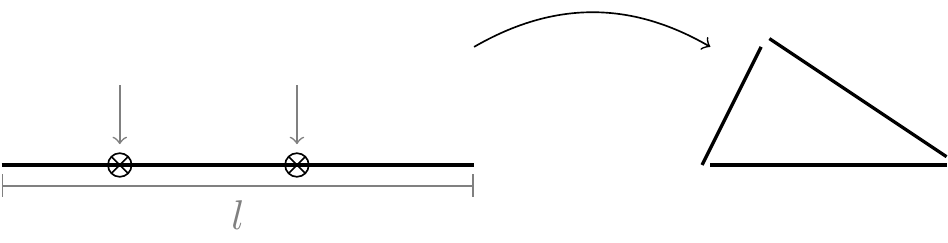
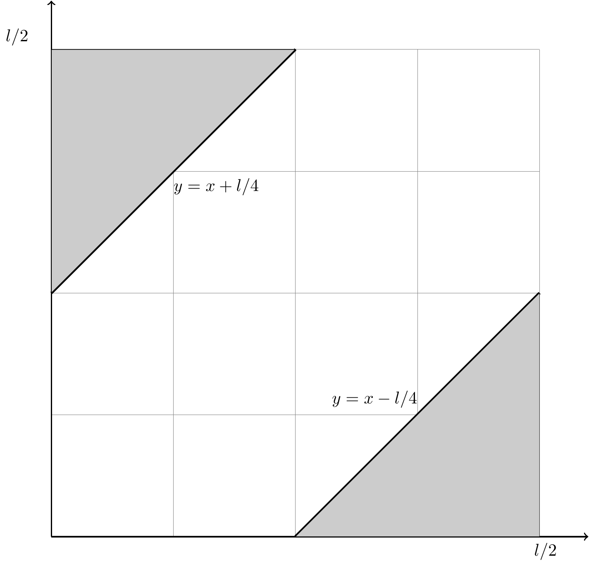

# El problema de la varilla de metal.

Este problema se puede formular como:

_a)_ Una varilla de metal de longitud $l$ se rompe en dos puntos distintos escogidos al azar. ¿Cuál es la probabilidad de que los tres segmentos ası́ obtenidos formen un triángulo?

O, de otra forma, como: 

_b)_ Se escogen dos números $x$ y $y$ al azar de manera independiente uno del otro, dentro del intervalo $(0, l)$. Calcule la probabilidad de que las longitudes $x$, $y$ y $l$ formen un triángulo.

_c)_ Se escogen tres números $x$, $y$ y $z$ al azar, de manera independiente uno del otro, dentro del intervalo $(0, l)$. Calcule la probabilidad de que las longitudes $x$, $y$ y $z$ formen un triángulo.

Para la primera formulación del problema, podemos considerar la distancia entre los puntos $x$ y $y$ definida como $\vert x - y \vert$. Para poder lograr formar un triangulo, la distancia entre los dos puntos seleccionados al azar debe ser mayor a $1/4$ de la longitud $l$, pero menos a $1/2$ de esa misma longitud. El razonamiento es el siguiente:

* Si $\vert x - y \vert > l/2$, entonces las longitudes de los fragmentos restantes, digamos $a$ y $b$, sumadas son menores a $l/2$; y queda $\vert x - y \vert > a + b$. Elevando ambos lados al cuadrado se obtiene:

 $$
 \begin{align}
     (x - y)^2 &> (a + b)^2 \\
         &> a^2 + b^2 - 2ab\text{Cos}\gamma + 2ab + 2ab\text{Cos}\gamma \\
         &> a^2 + b^2 - 2ab\text{Cos}\gamma
 \end{align}
 $$

 y la ley del coseno no se cumple, por lo que no es posible formar el triangulo. 

* Si $\vert x - y \vert < l/4$, entonces las longitudes de los fragmentos restantes, digamos $a$ y $b$, sumadas son mayores a $3l/4$; por lo que $\vert x - y \vert < a + b$. Al igual que antes:

 $$
 \begin{align}
     (x - y)^2 &< (a + b)^2 \\
         &< a^2 + b^2 - 2ab\text{Cos}\gamma + 2ab + 2ab\text{Cos}\gamma \\
         &< a^2 + b^2 - 2ab\text{Cos}\gamma
 \end{align}
 $$

 La ultima desigualdad se cumple dadas las desigualdades iniciales $\vert x - y \vert < l/4$ y $a + b > 3l/4$, por lo que la ley del coseno no se cumple, y no es posible formar el triangulo.

* Si $l/4 \le \vert x - y \vert \le l/2$, implica $l/2 \le a + b \le 3l/4$, de lo que se obtiene $\vert x - y \vert \le a + b$. Elevando al cuadrado ambos lados:
 
 $$
 \begin{align}
     (x - y)^2 &\le (a + b)^2 \\
         &\le a^2 + b^2 - 2ab\text{Cos}\gamma + 2ab + 2ab\text{Cos}\gamma \\
         &\le a^2 + b^2 - 2ab\text{Cos}\gamma
 \end{align}
 $$

 Como en la ultima expresión la igualdad es posible, la ley del coseno se cumple y es posible formar un triangulo.

Entonces, el triangulo es posible formarlo siempre y cuando $l/4 \le \vert x - y \vert \le l/2$. Por lo que, la variable aleatoria es el par $(x, y)$ en un espacio muestral $(0, l/2)\times(0, l/2)$. Se obtiene de la desigualdad 4 ecuaciones:

$$
\begin{align}
    \frac{l}{4} &\le x - y &\Rightarrow y &\ge x - \frac{l}{4} \\
    \frac{l}{4} &\le -(x - y) &\Rightarrow y &\le x + \frac{l}{4} \\
    \frac{l}{2} &\ge x - y &\Rightarrow y &\le x - \frac{l}{2} \\
    \frac{l}{4} &\le -(x - y) &\Rightarrow y &\le x + \frac{l}{2} \\
\end{align}
$$

y se puede observar en el gráfico siguiente, que los pares ordenados permitidas son aquellos que caen en el área denotada por los triángulos rectángulos que se forman arriba y debajo de las rectas $y = x - l/4$ y $y= x + l/4$. 

<!-- -->

Se observa en el gráfico, para facilitar la búsqueda de la probabilidad, que el área del espacio de probabilidad es el área del cuadrado cuyas aristas miden $l/2$, por lo que $\text{Área}(\Omega) = l/2 \times l/2 = l^2/4$; y que esta área se puede partir en 8 triángulos rectángulos de base $l/4$ y altura $l/4$, de los cuales dos, corresponden al área donde es posible formar un triangulo. De forma que $\text{Área}(A) = (l/4 \times l/4)/2 + (l/4 \times l/4)/2 = l^2/16$. Y la probabilidad buscada es:

$$P\{(x, y)\in\Omega: l/4 \le \vert x - y \vert \le l/2\} = \frac{\text{Área}(A)}{\text{Área}(\Omega)} = \frac{l^2/16}{l^2/4} = \frac{1}{4}$$

<!---rmarkdown::render("Tarea-1-Prob-Stat-2022.Rmd", "rdocx_document")--->
<!---rmarkdown::render("Tarea-1-Prob-Stat-2022.Rmd", "pdf_document")--->
