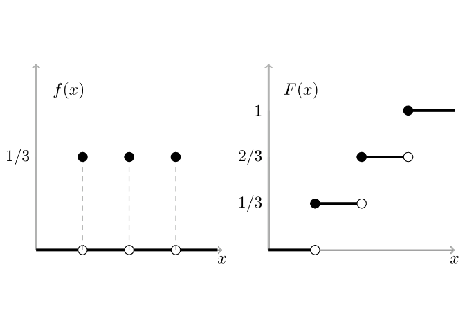
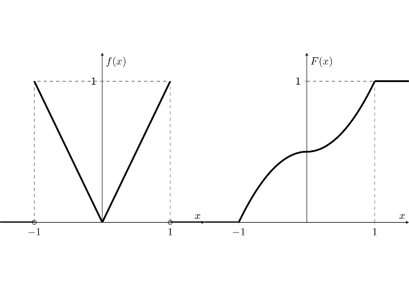

1. **Ejercicio 2.10**. Considere una variable aleatoria discreta $X$ con función de probabilidad:

$$f(x) = 
    \begin{cases}
        1/3 & \text{si } x = 1, 2, 3; \\
        0   & \text{de otra forma} 
    \end{cases}
$$

Encuentra para los distintos valores para $x$, la función de distribución $F(x)$. Grafica $f(x)$ y  $F(x)$.

El valor de $F(x)$ corresponde a la probabilidad acumulada hasta $x$, de tal forma que se puede definir como:

$$F(x) = P(X\le x) = \sum_{u\le x} f(u) = 
    \begin{cases}
        0 & \text{si } x < 1; \\
        1/3 & \text{si } 1 \le x < 2; \\
        2/3 & \text{si } 2 \le x < 3; \\
        1 & \text{si } x \ge 3
    \end{cases}
$$

De forma que la función de densidad es:

<!-- -->

2. **Ejercicio 2.11.** Considere ahora la variable aleatoria continua $X$ con función de densidad:

$$f(x) = 
    \begin{cases}
        \vert x \vert & \text{si } -1 \le x \le 1; \\
        0   & \text{de otra forma}
    \end{cases}
$$

Encuentra la función de distribución $F(x)$. Grafica $f(x)$ y $F(x)$.

El valor de $F(x)$ corresponde a la probabilidad acumulada hasta $x$, de tal forma que se puede definir como:

$$F(x) = P(X \le x) = \int_{-\infty}^x f(u)du = 
    \begin{cases}
        0 & \text{si } x < -1; \\
        (1-x^2)/2 & \text{si } -1 \le x < 0; \\
        (1+x^2)/2 & \text{si } 0 \le x < 1; \\
        1 & \text{si } x \ge 1
    \end{cases}
$$

<!-- -->

**Proposición 2.1** Toda función de distribución $F(x)$ satisface las siguientes propiedades:

* $\lim\limits_{x \to \infty} F(x) = 1$

_Dm._: 

* $\lim\limits_{x \to -\infty} F(x) = 0$

_Dm._: 

* Si $x_1 \le x_2$, entonces $F(x_1) \le F(x_2)$

_Dm._: 

* $F(x) = F(x+)$.

_Dm._: 

3. **Ejercicio 2.14**. Sea $X$ una variaqble aleatoria con función de distribución 

$$F(x) = 
    \begin{cases}
        0 & \text{si } x < -1; \\
        1/3 & \text{si } -1 \le x < 0; \\
        2/3 & \text{si } 0 \le x < 1; \\
        1 & \text{si } x \ge 1
    \end{cases}
$$

Como un ejemplo del cálculo de probabilidades usando la función de distribución, verifique los siguientes resultados:

* $P(X \le 1) = 1$.
* $P(X > 0) = 1/3$.
* $P(0 < X \le 1) = 1/3$
* $P(X = 0) = 1/3$.
